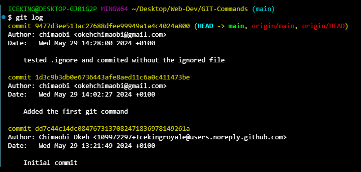
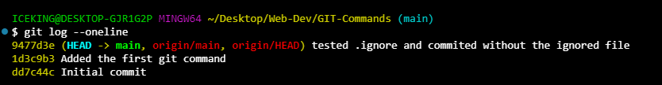
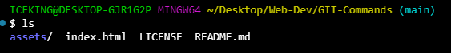

# GIT-Commands
The repo contains some of my favourite commands for working with git.

1.  `git init` is used to initalize a git repository

```sh
git init
```


2. `git status` is used to check the status of your files in the repository
```sh
git status
```


3. `git add` is used to track a file
```sh
git add file
```


4. `git commit` is used to commit a file.
```sh
git commit -m "description"
```


5. `git log` shows a log of all the commits available
```sh
git log
```



6. `git log --oneline` is used to display a simplified view of your logs
```sh
git log --oneline
```



7. `git checkout main` is used to make a version in your log and make it the main
```sh
git checkout main
```


8. `git pull` is used to update a local file with the current remote repository file
```sh
git pull
```

9. `ls` is used to list the contents of the current working directory
```sh
ls
```


10. `ls -a` is used to list the contents of the current working directory as well as all hidden files
```sh
ls -a
```


11. `git branch` is used to get all branches available
```sh
git branch
```


